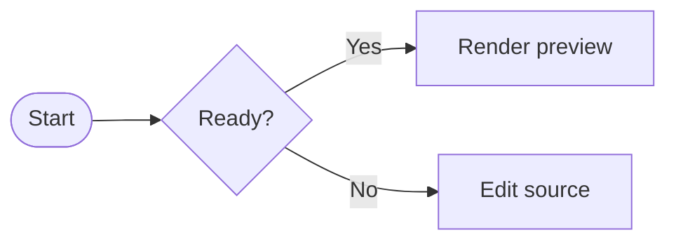
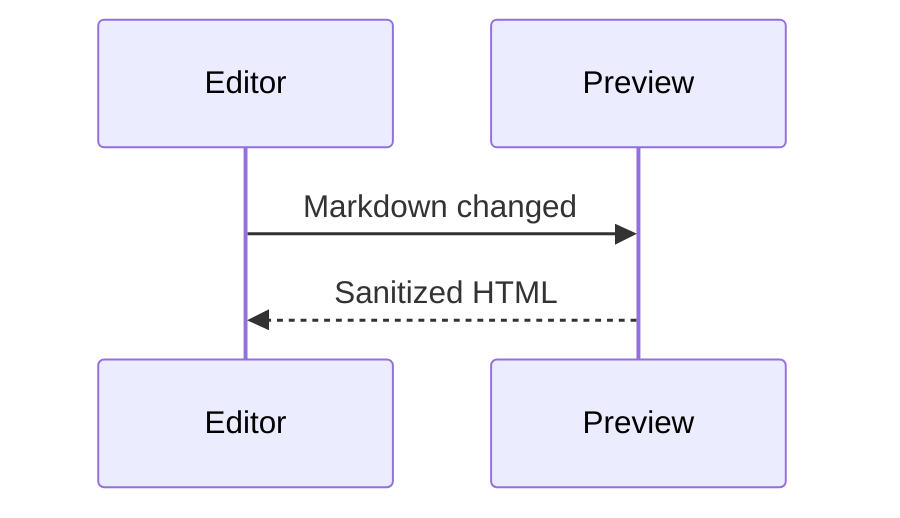
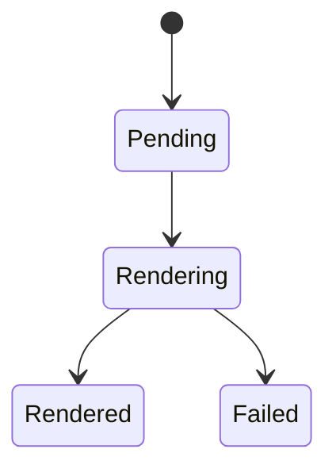
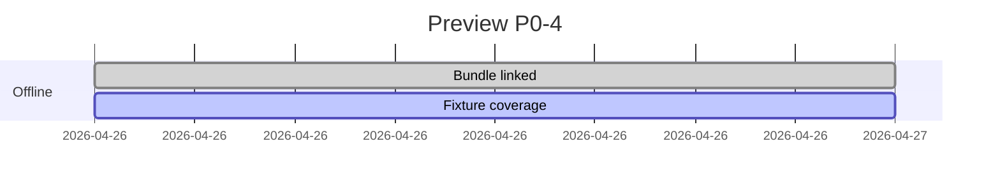
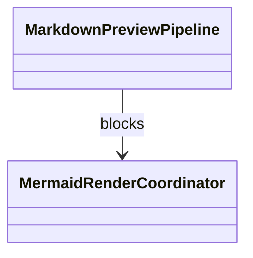
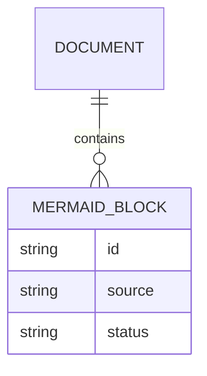

# Mermaid Preview Fixture

Representative Mermaid blocks used by offline preview pipeline tests.

## Flowchart

```mermaid
flowchart LR
    Start([Start]) --> Decision{Ready?}
    Decision -- Yes --> Render[Render preview]
    Decision -- No --> Fix[Edit source]
```

## Sequence

```mermaid
sequenceDiagram
    participant Editor
    participant Preview
    Editor->>Preview: Markdown changed
    Preview-->>Editor: Sanitized HTML
```

## State

```mermaid
stateDiagram-v2
    [*] --> Pending
    Pending --> Rendering
    Rendering --> Rendered
    Rendering --> Failed
```

## Gantt

```mermaid
gantt
    title Preview P0-4
    dateFormat  YYYY-MM-DD
    section Offline
    Bundle linked       :done, 2026-04-26, 1d
    Fixture coverage    :active, 2026-04-26, 1d
```

## Class

```mermaid
classDiagram
    class MarkdownPreviewPipeline
    class MermaidRenderCoordinator
    MarkdownPreviewPipeline --> MermaidRenderCoordinator : blocks
```

## Entity Relationship

```mermaid
erDiagram
    DOCUMENT ||--o{ MERMAID_BLOCK : contains
    MERMAID_BLOCK {
        string id
        string source
        string status
    }
```
